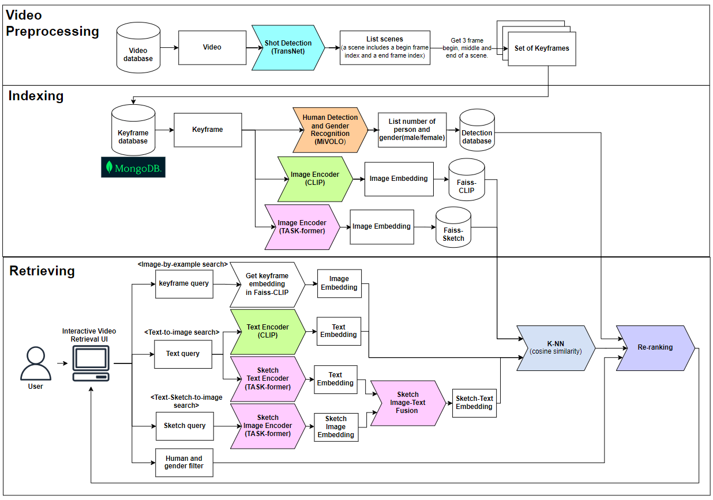

# Enhacing Video Retrival with Robust CLIP-Based Multimodal System

## Authors

* [Tuan Quang](https://github.com/thq1995)
* [Huy Van Dinh](https://github.com/dvanhuy11)
* [Minh Dung Le Quynh](https://github.com/LeQuynhMinhDung)
* [Anh Tuan Nguyen](https://github.com/TuanThanhDat)
* [Huy Tien Nguyen](https://github.com/huynt654)
* [Minh-Hung An](https://github.com/anminhhung)


## Sytem pipeline 


## Setup Instruction
* ### Data Setup
    Download files below and move those files to backend folder
    - [index_1_36.bin](https://drive.google.com/file/d/1q5vzkEwNFz4bMwlXJAvoeM3V1hFu59Eg/view?usp=sharing)
    - [sketch_index.bin](https://drive.google.com/file/d/15Tm4SML_9UaanXXB7cgW5NqyB6UR5UGP/view?usp=sharing)
    - [Pre-trained models for sketch](https://patsorn.me/projects/tsbir/data/tsbir_model_final.pt)
    - [person_detection.npy](https://drive.google.com/file/d/1-8K5WNBGfdCFdP-UX00qJ25Xuymimq20/view?usp=sharing)
    

* ### Install MongoDB and Anaconda 
    MongoDB is for keyframes storage. Anaconda is for python environment. Please use the link below for installing instruction. 
    - [Install MongoDB Driver](https://www.mongodb.com/docs/manual/installation/)
    - [Install MongoDB Compass for User Interface](https://www.mongodb.com/docs/compass/current/install/)
    - [Install Anaconda](https://www.anaconda.com/download)

* ### Backend
    After cloning the repository, navigate to the backend folder. After installing anaconda, use the command below for installing packages for the environment.

    ```
    conda create -n AIC_ENV
    conda activate AIC_ENV
    pip install git+https://github.com/openai/CLIP.git
    pip install -r requirements.txt
    ```

* ### Sketch Pre-trained models
    After downloading pre-trained modeels for sketch, move file `tsbir_model_final.pt` to path `VN_Video_Search_with_Sketch/backend/SketchModel/model`

* ### Frontend
    Install Node.js for installing dependencies for frontend. After installing Node.js, navigate to frontend folder and run the command below for isntalling the dependencies.
    - [Install Node.js](https://nodejs.org/en/download)
    ```
    npm install
    ```
## Usage
* ### Frames Extraction
    After activating conda environment, navigate to `backend/Notebook/Transnet.ipynb` for frame extraction. Run the notebook with AIC_ENV environment in [Backend Instruction](#backend).

* ### Creating binary files
    Please refer to `backend/Notebook` for creating binary files for CLIP and Sketch Model.
    
* ### MongoDB Database 
    For database, make sure to turn on the driver for mongo. Please take a look at the [Install MongoDB and Anaconda](#install-mongodb-and-anaconda) for references. Navigate to backend folder and run the command below for pushing data into database.
    ```
    python setup_database.py
    ```
* ### Backend 
    Navigate to backend folder and run the command
    ```
    python app.py
    ```
* ### Frontend 
    Navigate to frontend folder and run the command
    ```
    npm run start
    ```
    A [http://localhost:3000/home](http://localhost:3000/home) should be launched after executing the command.
    
    
